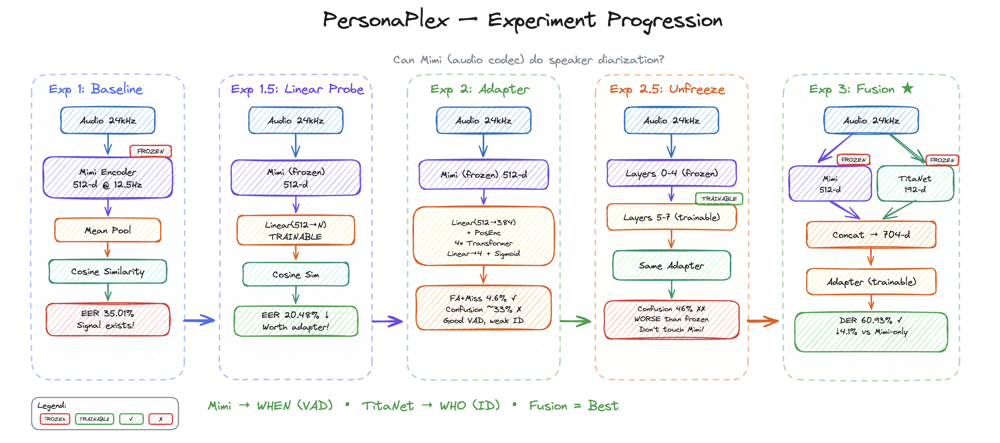

# PersonaPlex Voice Diarization

## Goal: Tldr

To basically transform Nvidia's PersonaPlex model, which is part of a family of conversational models by Nvidia, built on top of the moshi model by kyutai. Since I dont really have too much in training expenditure, I only want to anlyze and modify the encoder for the same. 

The encoder, referred to as the MiMi encoder, is said to encode both the semantic content(what a person speaks) along with their acoustic information(pitch, tone etc.) and produce a vector with both this information encoded in it. 

My task to analyze whether MiMi comes out of the box with speaker diarization enabled, even though its not built for that, and whether it can capture these acoustic information to carefully split the different types of speakers. 

And if its not doing so, possibly make changes to the encoder to make it possible for it to diarize voice on the fly


## Problem

**Can you modify an existing neural audio codec to add speaker diarization?**

Mimi encodes identity but it's entangled with phonemes, prosody, and channel noise. The question: is that signal accessible enough for diarization, or do we need a dedicated speaker encoder?

## Experiment Progression



*Can Mimi (audio codec) do speaker diarization?* The diagram shows all five experiments in sequence. **Mimi → WHEN (VAD)** | **TitaNet → WHO (ID)** | **Fusion = Best**

---

## The Story: Five Experiments in Sequence

We tested options one after the other. Each experiment answered a specific question and led to the next.

### Experiment 1: Baseline — Is there any speaker signal at all?

**Question:** Does Mimi's pre-quantization embedding space contain speaker information, or is it purely content-focused?

**What we did:** Extract 512-d embeddings from frozen Mimi for VoxCeleb1, mean-pool each utterance, compute cosine similarity on 37,611 verification pairs. No training.

**Result: EER 35.01%**

**Why it happened:** Same-speaker pairs scored higher (0.572) than different-speaker pairs (0.447)—so speaker info exists. But 35% EER means the distributions overlap heavily. Mimi was trained to reconstruct audio; speaker identity is encoded but tangled with phonemes, prosody, and channel. Raw cosine on a mean-pooled vector is too crude to untangle it.

**Conclusion:** Signal exists. Need a learned transform.

---

### Experiment 1.5: Linear Probe — Is the signal linearly separable?

**Question:** Can a simple linear layer extract speaker identity from the 512-d space?

**What we did:** Train a single linear layer (512 → N speakers) on VoxCeleb1, then evaluate EER in the projected space.

**Result: EER 20.48%** (down from 35%)

**Why it happened:** The linear layer learned directions that separate speakers. Score gap widened from 0.125 to 0.419. Speaker identity is not axis-aligned in the raw space, but it's linearly accessible. A deeper model should do even better.

**Conclusion:** Worth building a full adapter. Proceed to diarization.

---

### Experiment 2: Adapter on Frozen Mimi — Can we do diarization?

**Question:** Can a 4-layer Transformer adapter on frozen Mimi embeddings perform speaker diarization (who spoke when)?

**What we did:** Train adapter on AMI + NeMo-simulated LibriSpeech. Mimi frozen. Adapter: Linear(512→384) → 4× Transformer → Head(4 speakers) → Sigmoid. Hybrid loss (Sort + PIL).

**Result: FA+Miss 4.6%, confusion ~33%**

**Why it happened:** The model nailed *when* speech occurs—VAD is excellent. But it frequently assigned the wrong speaker channel. Mimi's embeddings carry enough for "is someone talking?" but not enough for "which of these four voices is this?" The codec was never trained to discriminate speakers; its bottleneck likely discards fine-grained identity cues.

**Conclusion:** Mimi gives when, not who. Need speaker-specific signal.

---

### Experiment 2.5: Unfreeze — Can we fix Mimi from the inside?

**Question:** Maybe Mimi has speaker info deeper in the network. Can fine-tuning the top layers unlock it?

**What we did:** Unfreeze top 3 of 8 `encoder_transformer` layers. Same adapter, same data, same loss. Dual learning rates (lower for Mimi, higher for adapter).

**Result: Confusion 33% → 46%** (worse)

**Why it happened:** Fine-tuning made speaker discrimination worse. Mimi's architecture was optimized for reconstruction. The codec objective doesn't preserve speaker-discriminative information—it likely suppresses it to avoid overfitting to speaker-specific quirks. Modifying Mimi's internals doesn't create capability that wasn't trained in.

**Conclusion:** Don't touch Mimi. Add a dedicated speaker encoder instead.

---

### Experiment 3: Fusion — Mimi + TitaNet

**Question:** Can we fuse Mimi (VAD, acoustic features) with TitaNet (speaker embeddings) and get the best of both?

**What we did:** Run audio through Mimi (frozen) and TitaNet (frozen). Concat 512 + 192 = 704-d. Same adapter architecture. Same data pipeline.

**Result: DER 60.93% vs Mimi-only 65.03%** (−4.1%)

**Why it happened:** TitaNet injects speaker identity. DER dropped. Confusion still high (~57%) because we predict at frame level—segment-level interpolation and overlapping speech remain hard. But the direction is right: hybrid encoder works.

**Conclusion:** Mimi + dedicated speaker encoder is the path forward.

---

## Results Summary

| Experiment | Result | Why |
|------------|--------|-----|
| **1: Baseline** | EER 35.01% | Speaker info present but entangled. Raw cosine insufficient. |
| **1.5: Linear Probe** | EER 20.48% | Signal linearly separable. Adapter worth trying. |
| **2: Adapter** | FA+Miss 4.6%, confusion ~33% | Good VAD, weak speaker ID. Mimi gives when, not who. |
| **2.5: Unfreeze** | Confusion 33% → 46% | Fine-tuning made it worse. Codec discards speaker info. |
| **3: Fusion** | DER 60.93% vs 65.03% (−4.1%) | TitaNet helps. Hybrid encoder is the answer. |

---

## Experiments

| Experiment | README | Entry point |
|------------|--------|-------------|
| Exp 1: Baseline | [baseline/README.md](encoder_modification/baseline/README.md) | `run_baseline.py` |
| Exp 1.5: Linear probe | [probe/README.md](encoder_modification/probe/README.md) | `run_linear_probe.py` |
| Adapter (VoxCeleb PoC) | [adapter/README.md](encoder_modification/adapter/README.md) | `run_adapter.py` |
| Exp 2: Adapter (AMI) | [training/README.md](encoder_modification/training/README.md) | `training/train.py` |
| Exp 2.5: Unfreeze | [training/unfreeze/README.md](encoder_modification/training/unfreeze/README.md) | `training/unfreeze/run_ft.sh` |
| Exp 3: Fusion | [encoder_fusion/README.md](encoder_modification/encoder_fusion/README.md) | `encoder_fusion/run.sh` |

## Setup

```bash
pip install -r requirements.txt
```

Paths auto-detect from repo structure. Override via env vars:
- `ENCODER_MODIFICATION_ROOT` — project root
- `MIMI_CHECKPOINT` — Mimi weights path
- `DIARIZATION_ROOT` — data root (default `/workspace/diarization`)

### Colab

```python
import os
os.environ["ENCODER_MODIFICATION_ROOT"] = "/content/PersonaPlex-Voice-Diarization"
os.environ["MIMI_CHECKPOINT"] = "/content/weights/tokenizer-e351c8d8-checkpoint125.safetensors"
```

Download Mimi checkpoint from [nvidia/personaplex-7b-v1](https://huggingface.co/nvidia/personaplex-7b-v1) (gated, accept license first).

## File structure

```
PersonaPlex-Voice-Diarization/
├── requirements.txt
├── assets/                 
├── encoder_modification/
│   ├── config.py
│   ├── run_baseline.py
│   ├── run_linear_probe.py
│   ├── run_adapter.py
│   ├── baseline/          # Exp 1
│   ├── probe/             # Exp 1.5
│   ├── data/
│   ├── adapter/           # VoxCeleb PoC
│   ├── training/          # Exp 2
│   │   └── unfreeze/      # Exp 2.5
│   └── encoder_fusion/    # Exp 3
├── moshi/
└── weights/
```

## References

- [Sortformer](https://arxiv.org/abs/2409.06656) — Sort Loss + PIL for diarization
- [PersonaPlex](https://arxiv.org/abs/2501.03489) — Voice and role control
- [Moshi/Mimi](https://github.com/kyutai/moshi) — Neural audio codec
