# Stage 5 Diagnostic Suite - Output Explanations

## Overview
Tests whether Mimi captures speaker identity or text content using our synthetic dataset.

---

## Analysis Results Outputs

### 1. `analysis_report.txt`
**What we learned:** Final verdict on whether Mimi works for speaker diarization. Shows pass/fail for each metric and overall assessment.

---

### 2. `acoustics_vs_semantics.png`
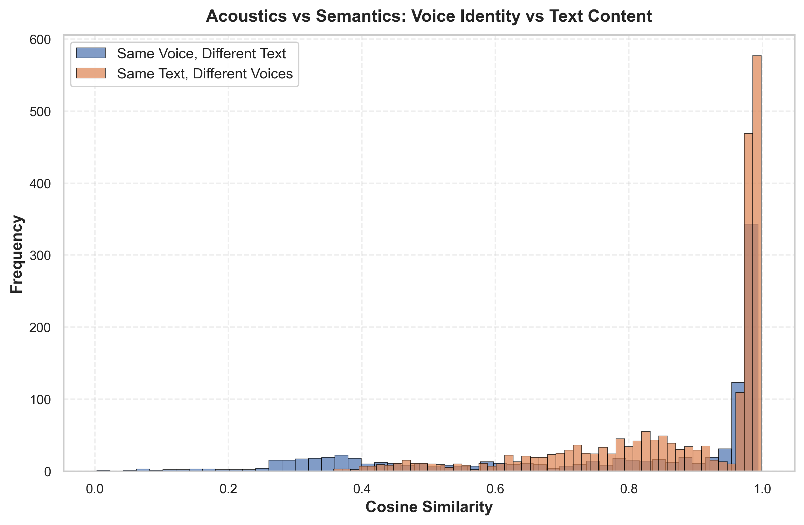

**What we learned:** Mimi captures text, not voice. Same text with different speakers has higher similarity than same speaker with different text. This is backwards from what we need.

---

### 3. `voice_space_pca2d.png`
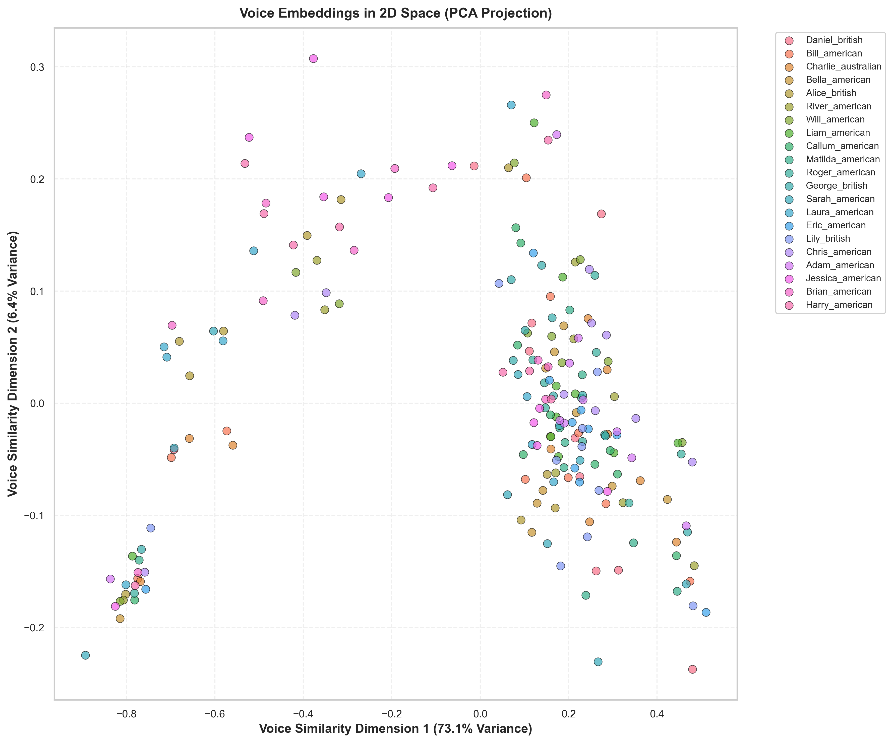

**What we learned:** Voices overlap significantly. Can't clearly separate speakers in 2D space. Same-speaker samples are inconsistent.

---

### 4. `voice_clustering.png`
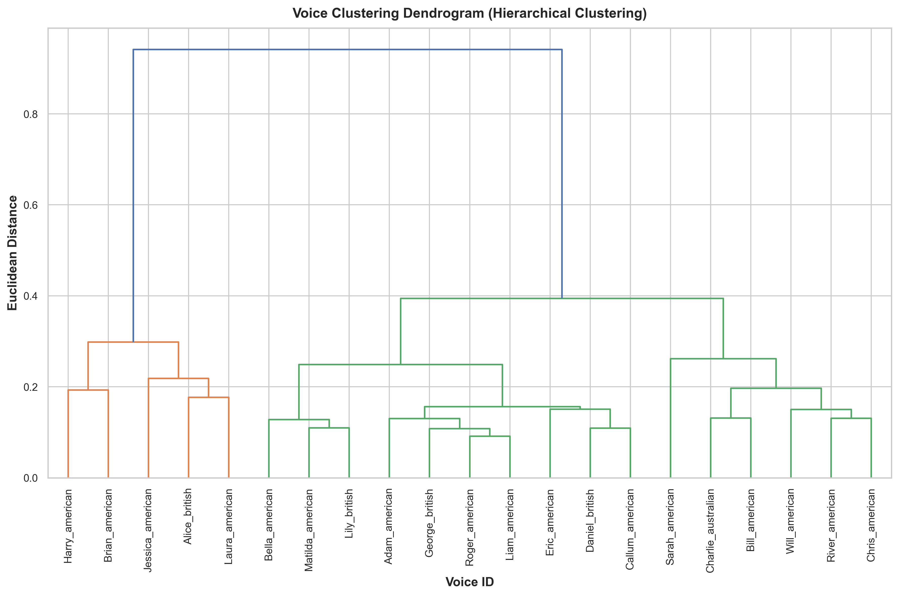

**What we learned:** Some voice pairs cluster very close together, meaning they'll be confused. Speakers with similar characteristics (gender, accent) group together.

---

### 5. `robustness.png`
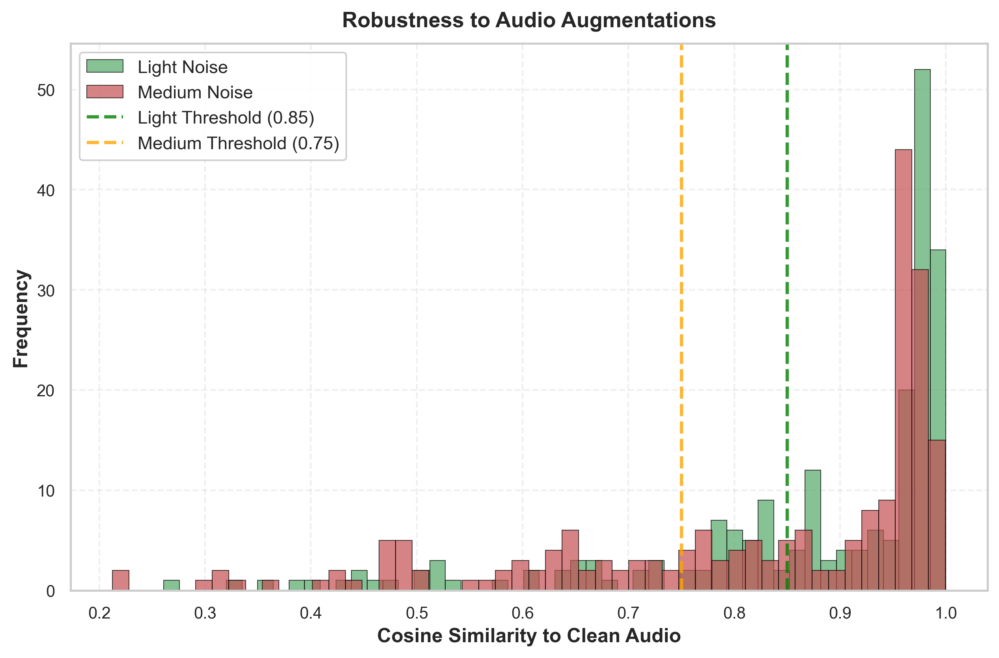

**What we learned:** Embeddings degrade with noise. Many samples fall below thresholds, meaning speaker identity is lost when audio quality drops.

---

## Embedding Deep Dive Outputs

### 6. `embedding_deep_dive/channel_statistics.png`
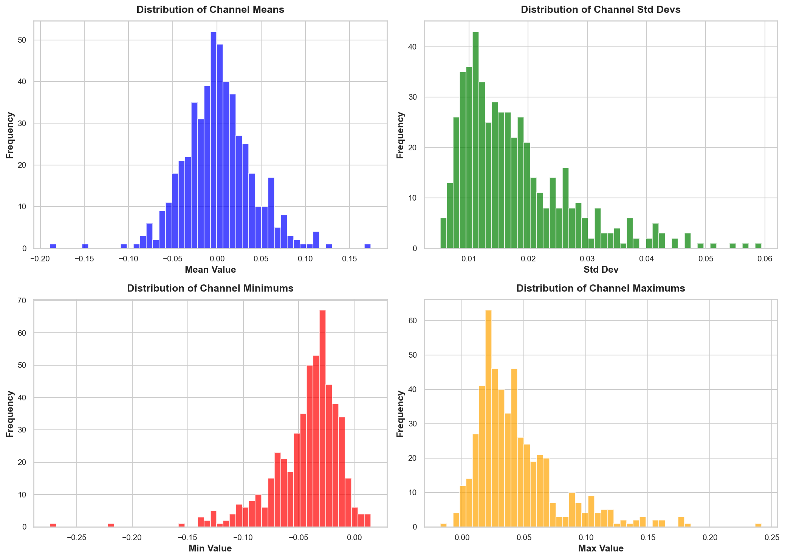

**What we learned:** Channels have different activation patterns. Some vary a lot (useful), others stay constant (useless). Most channels are doing something, not dead.

---

### 7. `embedding_deep_dive/discriminative_channels.csv` & `top_discriminative_channels.png`
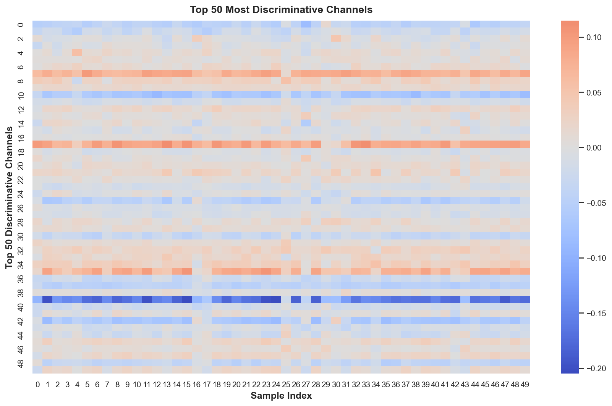

**What we learned:** Only a subset of channels actually distinguish speakers. We could reduce from 512D to maybe 50-100 channels without losing much.

---

### 8. `embedding_deep_dive/value_distributions.png`
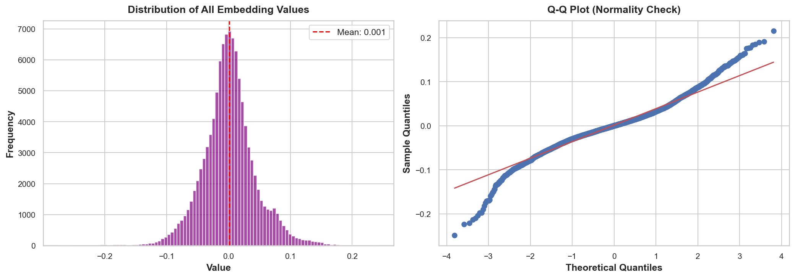

**What we learned:** Values are roughly normally distributed. This means cosine similarity is appropriate. No weird outliers or artifacts.

---

### 9. `embedding_deep_dive/channel_correlations.png`
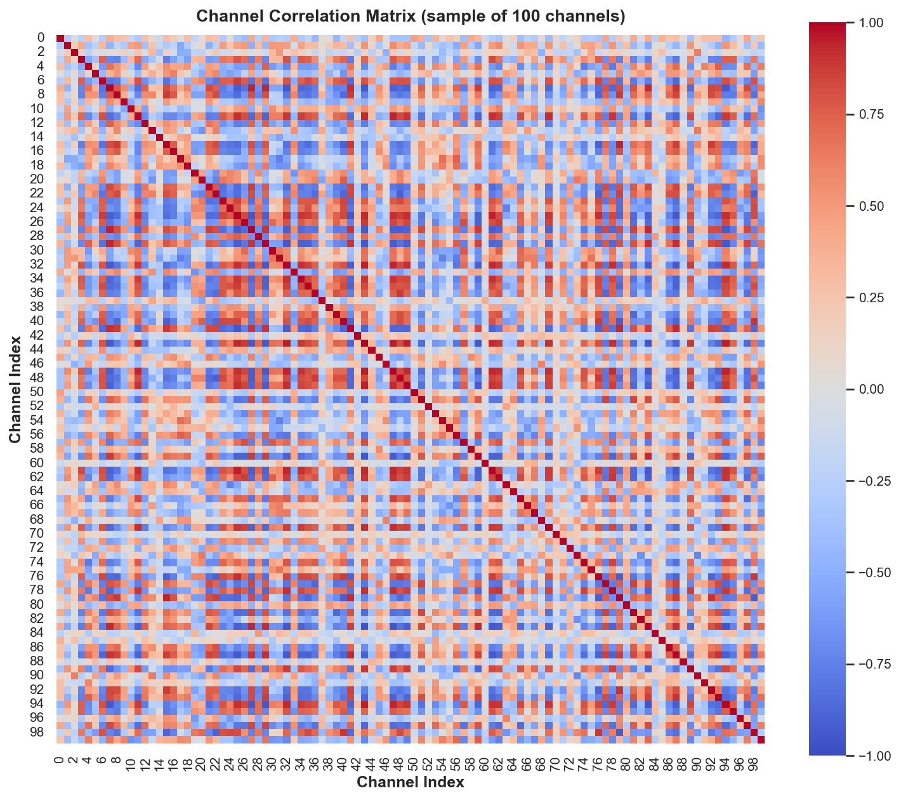

**What we learned:** Many channels are correlated. Lots of redundancy. We can reduce dimensionality without losing information.

---

### 10. `embedding_deep_dive/dimensionality.png`
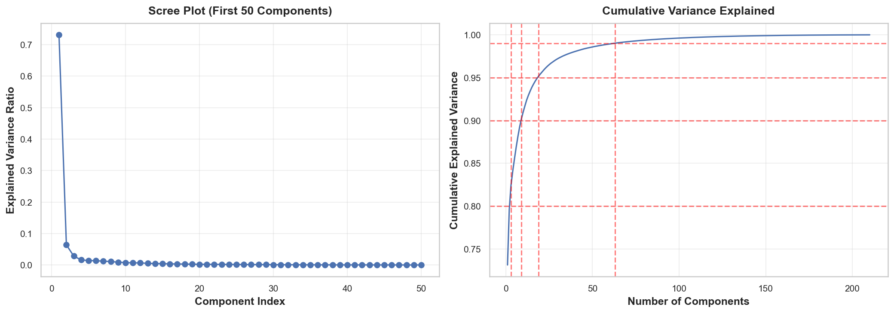

**What we learned:** First 50-100 dimensions capture most variance. This validates why PCA works. We don't need all 512 dimensions.

---

### 11. `embedding_deep_dive/activation_heatmap.png`
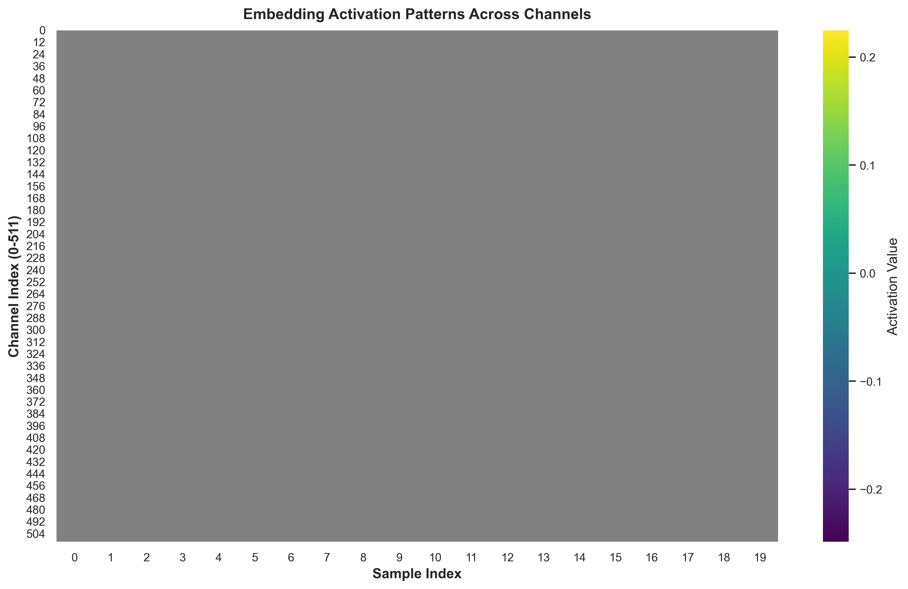

**What we learned:** Some channels are always on or always off. Some samples have unusual patterns. No obvious bugs, but patterns are complex.

---

### 12. `embedding_deep_dive/pair_comparison_*.png` (5 files)
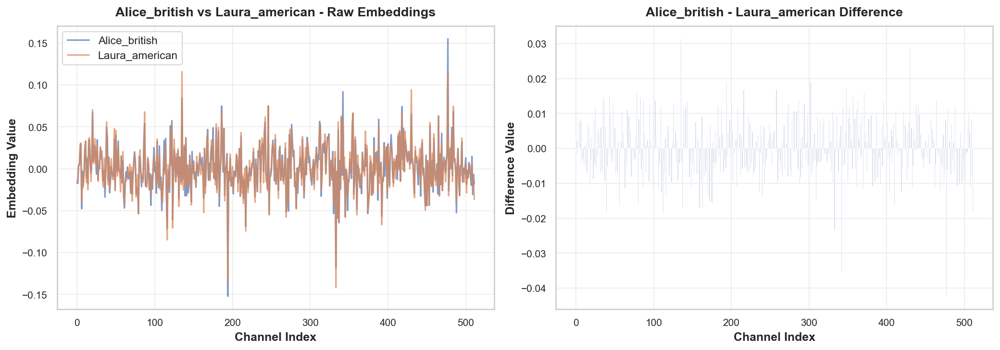
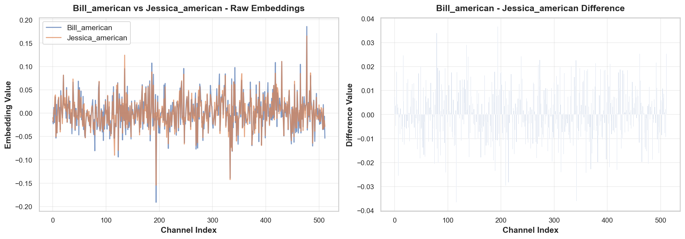

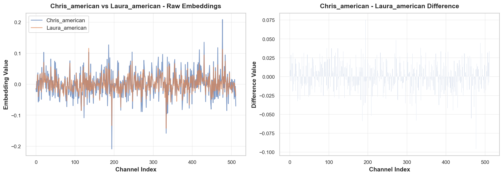
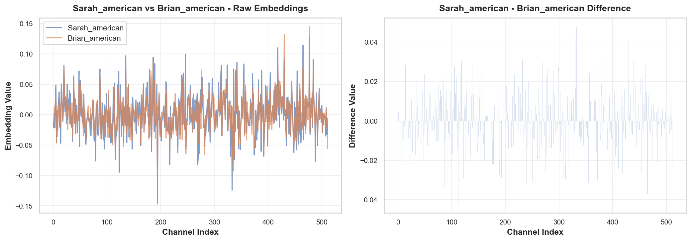

**What we learned:** Different voice pairs use different channels to distinguish. Some pairs are easy to separate, others are hard. Gender and accent affect separability.

---

## Diagnostic Results Outputs

### 13. `diagnostic_results/diagnostic_results.csv` & `.json`
**What we learned:** Raw data showing all tested configurations. Best configs have high acoustics score (>0.10) and separability ratio (>2.0).

---

### 14. `diagnostic_results/extraction_pooling_heatmap.png`
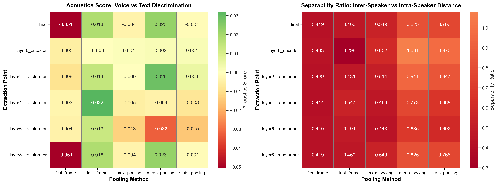

**What we learned:** Encoder extraction with mean pooling works best. Transformer extraction adds semantic content and hurts. Last frame pooling sometimes beats mean.

---

### 15. `diagnostic_results/duration_effect.png`
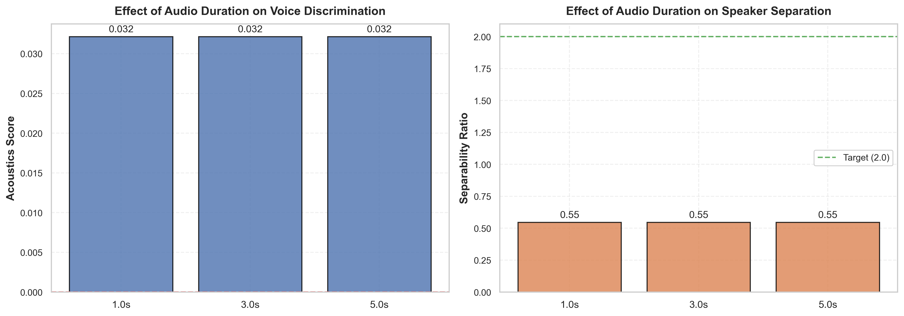

**What we learned:** Longer audio helps up to a point. 3-5 seconds is the sweet spot. Very short clips (<1s) don't work well.

---

### 16. `diagnostic_results/postprocessing_effect.png`
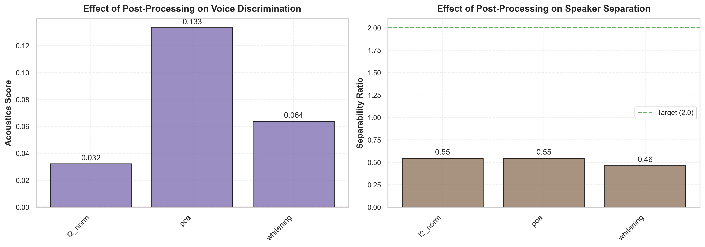

**What we learned:** PCA is essential. Without it, acoustics score is negative. With PCA, it becomes positive. L2 norm doesn't help much. Whitening helps a bit.

---

## Key Findings

**Problems:**
1. Mimi captures text more than voice (negative acoustics score without PCA)
2. Speakers aren't well separated (ratio < 1.0 without post-processing)
3. Same speaker embeddings are inconsistent

**Solutions:**
1. PCA post-processing fixes the acoustics score (negative to positive)
2. Mean pooling works best for temporal aggregation
3. Use encoder features, not transformer features

**Next steps:**
1. Fine-tune a speaker projection network on top of Mimi
2. Try contrastive learning to improve separability
3. Consider switching to speaker-specific encoders (WavLM, ECAPA-TDNN)
